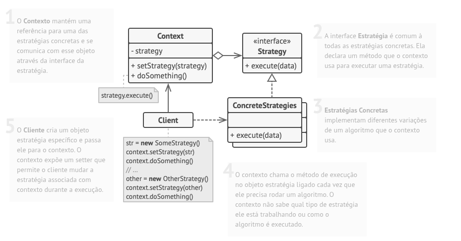

# Design Patterns

- [x] Singleton
- [x] Strategy
- [ ] Decorator
- [ ] Observer
- [ ] Factory Method

## Singleton:

O Singleton é um padrão de projeto **criacional** que permite a você garantir que uma classe tenha apenas uma instância, enquanto provê um ponto de acesso global para essa instância.
 

**Todas as implementações do Singleton tem esses dois passos em comum**: 
* Fazer o construtor padrão privado, para prevenir que outros objetos usem o operador new com a classe singleton. 
* Criar um método estático de criação que age como um construtor. Esse método chama o construtor privado por debaixo dos panos para criar um objeto e o salva em um campo estático.  
* Todas as chamadas seguintes para esse método retornam o objeto em cache. 
**Estrutura**

Existem três maneiras comuns de implementar o padrão Singleton em Java: **Lazy Initialization**, **Eager Singleton** e **Lazy Holder Singleton**. Cada abordagem tem seus próprios benefícios e desvantagens, e a escolha da abordagem correta dependerá dos requisitos específicos da sua aplicação. 

**Lazy** 
A instância é criada apenas quando necessário. Isso pode ajudar a economizar recursos de memória, mas pode resultar em um pequeno atraso no tempo de inicialização da instância.
 
**Eager** 
A instância é criada logo na declaração da variável, tornando a criação da instância mais rápida. Essa abordagem é ideal quando você precisa que a instância esteja disponível imediatamente.
 
**Lazy Holder Singleton** 
A abordagem Lazy Holder Singleton é uma variação da abordagem Lazy Initialization, onde a instância é encapsulada em uma classe privada que é carregada somente quando a instância é chamada pela primeira vez. Isso combina os benefícios das abordagens Lazy Initialization e Eager Singleton e é geralmente considerada a melhor abordagem para implementar o padrão Singleton em Java.

## Strategy:

O Strategy é um padrão de projeto **comportamental** que permite que você defina uma família de algoritmos, coloque-os em classes separadas, e faça os objetos deles intercambiáveis. 
**Aplicabilidade**: 

* Utilize o padrão Strategy quando você quer usar diferentes variantes de um algoritmo dentro de um objeto e ser capaz de trocar de um algoritmo para outro durante a execução. 
* Utilize o Strategy quando você tem muitas classes parecidas que somente diferem na forma que elas executam algum comportamento. 
* Utilize o padrão para isolar a lógica do negócio de uma classe dos detalhes de implementação de algoritmos que podem não ser tão importantes no contexto da lógica. 
* Utilize o padrão quando sua classe tem um operador condicional muito grande que troca entre diferentes variantes do mesmo algoritmo. 

No Strategy, normalmente usa-se interface, porque o foco é definir um contrato para estratégias intercambiáveis. 
Use classe abstrata quando houver comportamento comum entre as estratégias. 

Exemplo: 

* Interface: quando cada estratégia só precisa implementar a lógica. 
* Abstrata: quando várias estratégias compartilham código. 

**Estrutura**

