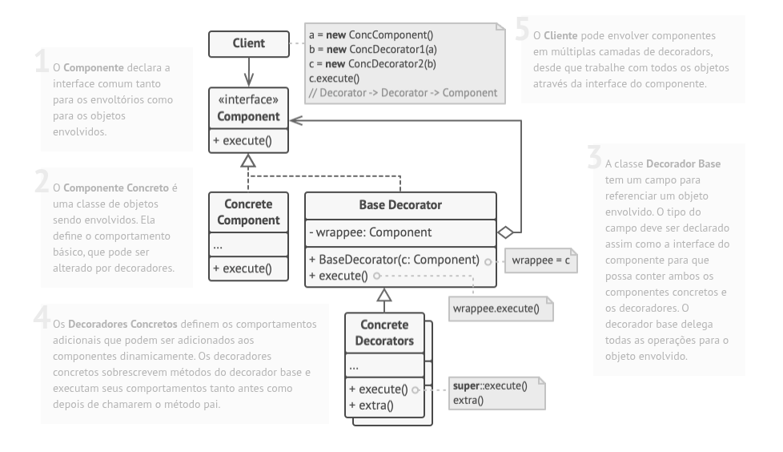
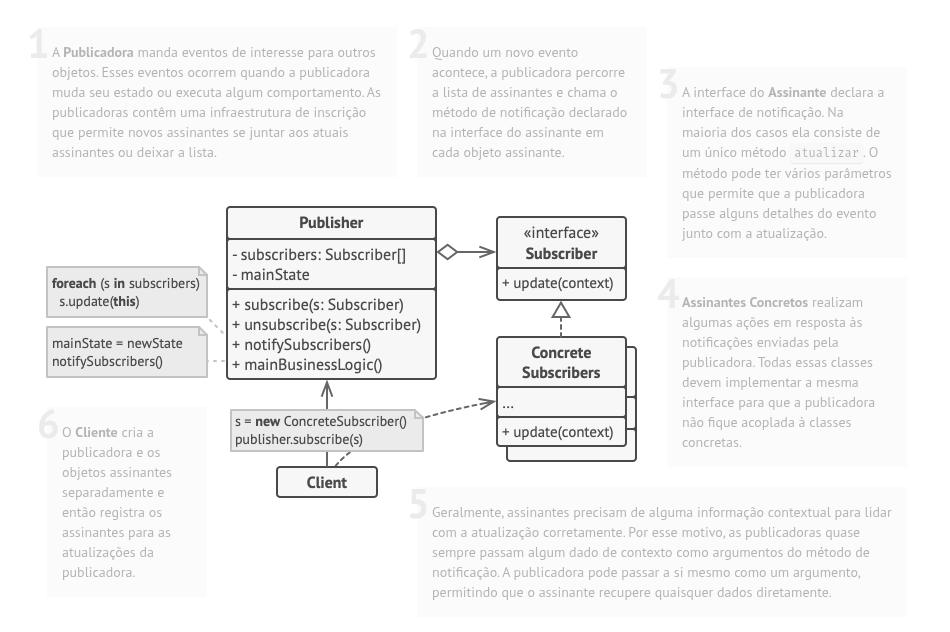

# Design Patterns

- [x] Singleton
- [x] Strategy
- [x] Decorator
- [x] Observer
- [ ] Factory Method

## Singleton:

O Singleton é um padrão de projeto **criacional** que permite a você garantir que uma classe tenha apenas uma instância, enquanto provê um ponto de acesso global para essa instância.
 

**Todas as implementações do Singleton tem esses dois passos em comum**: 
* Fazer o construtor padrão privado, para prevenir que outros objetos usem o operador new com a classe singleton. 
* Criar um método estático de criação que age como um construtor. Esse método chama o construtor privado por debaixo dos panos para criar um objeto e o salva em um campo estático.  
* Todas as chamadas seguintes para esse método retornam o objeto em cache. 
**Estrutura**

Existem três maneiras comuns de implementar o padrão Singleton em Java: **Lazy Initialization**, **Eager Singleton** e **Lazy Holder Singleton**. Cada abordagem tem seus próprios benefícios e desvantagens, e a escolha da abordagem correta dependerá dos requisitos específicos da sua aplicação. 

**Lazy** 
A instância é criada apenas quando necessário. Isso pode ajudar a economizar recursos de memória, mas pode resultar em um pequeno atraso no tempo de inicialização da instância.
 
**Eager** 
A instância é criada logo na declaração da variável, tornando a criação da instância mais rápida. Essa abordagem é ideal quando você precisa que a instância esteja disponível imediatamente.
 
**Lazy Holder Singleton** 
A abordagem Lazy Holder Singleton é uma variação da abordagem Lazy Initialization, onde a instância é encapsulada em uma classe privada que é carregada somente quando a instância é chamada pela primeira vez. Isso combina os benefícios das abordagens Lazy Initialization e Eager Singleton e é geralmente considerada a melhor abordagem para implementar o padrão Singleton em Java.

## Strategy:

O Strategy é um padrão de projeto **comportamental** que permite que você defina uma família de algoritmos, coloque-os em classes separadas, e faça os objetos deles intercambiáveis. 
**Aplicabilidade**: 

* Utilize o padrão Strategy quando você quer usar diferentes variantes de um algoritmo dentro de um objeto e ser capaz de trocar de um algoritmo para outro durante a execução. 
* Utilize o Strategy quando você tem muitas classes parecidas que somente diferem na forma que elas executam algum comportamento. 
* Utilize o padrão para isolar a lógica do negócio de uma classe dos detalhes de implementação de algoritmos que podem não ser tão importantes no contexto da lógica. 
* Utilize o padrão quando sua classe tem um operador condicional muito grande que troca entre diferentes variantes do mesmo algoritmo. 

No Strategy, normalmente usa-se interface, porque o foco é definir um contrato para estratégias intercambiáveis. 
Use classe abstrata quando houver comportamento comum entre as estratégias. 

Exemplo: 

* Interface: quando cada estratégia só precisa implementar a lógica. 
* Abstrata: quando várias estratégias compartilham código. 

**Estrutura**

## Decorator
O Decorator é um padrão de projeto **estrutural** que permite que você acople novos comportamentos para objetos ao colocá-los dentro de invólucros de objetos que contém os comportamentos.

**Problema**
Você deseja adicionar comportamento ou estado a objetos individuais em tempo de execução. A herança não é viável porque é estática e se aplica a uma classe inteira.

**Solução**
Estender uma classe é a primeira coisa que vem à mente quando você precisa alterar o comportamento de um objeto. No entanto, a herança tem várias advertências sérias que você precisa estar ciente.
* A herança é estática. Você não pode alterar o comportamento de um objeto existente no tempo de execução. Você só pode substituir o objeto inteiro por outro criado a partir de uma subclasse diferente.
* As subclasses podem ter apenas uma classe pai. Na maioria das linguagens, a herança não permite que uma classe herde comportamentos de várias classes ao mesmo tempo.

Uma das maneiras de superar essas advertências é usando Agregação ou Composição em vez de herança . Ambas as alternativas funcionam quase da mesma maneira: um objeto faz referência a outro e delega-lhe algum trabalho, enquanto que com a herança, o próprio objeto é capaz de fazer esse trabalho, herdando o comportamento de sua superclasse.

**Estrutura**

## Observer
O Observer é um padrão de projeto **comportamental** que permite que você defina um mecanismo de assinatura para notificar múltiplos objetos sobre quaisquer eventos que aconteçam com o objeto que eles estão observando.

**Problema**
Imagine que você tem dois tipos de objetos: um Cliente e uma Loja. O cliente está muito interessado em uma marca particular de um produto (digamos que seja um novo modelo de iPhone) que logo deverá estar disponível na loja.

O cliente pode visitar a loja todos os dias e checar a disponibilidade do produto. Mas enquanto o produto ainda está a caminho, a maioria desses visitas serão em vão.

Por outro lado, a loja poderia mandar milhares de emails (que poderiam ser considerados como spam) para todos os clientes cada vez que um novo produto se torna disponível. Isso salvaria alguns clientes de incontáveis viagens até a loja. Porém, ao mesmo tempo, irritaria outros clientes que não estão interessados em novos produtos.

Parece que temos um conflito. Ou o cliente gasta tempo verificando a disponibilidade do produto ou a loja gasta recursos notificando os clientes errados.

**Solução**
O objeto que tem um estado interessante é quase sempre chamado de sujeito, mas já que ele também vai notificar outros objetos sobre as mudanças em seu estado, nós vamos chamá-lo de publicador. Todos os outros objetos que querem saber das mudanças do estado do publicador são chamados de assinantes.

O padrão Observer sugere que você adicione um mecanismo de assinatura para a classe publicadora para que objetos individuais possam assinar ou desassinar uma corrente de eventos vindo daquela publicadora. Nada tema! Nada é complicado como parece. Na verdade, esse mecanismo consiste em 1) um vetor para armazenar uma lista de referências aos objetos do assinante e 2) alguns métodos públicos que permitem adicionar assinantes e removê-los da lista.

**Estrutura**

